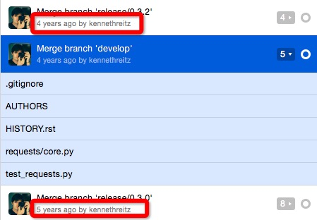

## Requests v0.4.0

### 0x01 照例说几句

昨天几个老司机在我朋友圈说，小伙子我看好你噢。

鼓励是鞭子，不是兴奋剂。

多谢老司机。

### 0x02 HISTORY.rst

```
0.4.0 (2011-05-15)
++++++++++++++++++


```

距离上个大版本两个多月的时间，我去github 里面 issue 看了下milestone。有四个issue与v0.4.0 的milestone有关。

依照惯例，我们从每个版本的更新的翻译开始。（话说history 现在都不注明 issue了，还得一个一个去查）

```
0.3.1 (2011-04-01)
++++++++++++++++++

* Cookie Changes
* Response.read()
* Poster fix
```

1. cookie改变。怀疑是支持的方式有改，原来好像是直接调用了urllib的函数。
2. Response.read() 给返回的类加了一个方法？ ...history 不能这么写啊...这让我怎么猜..
3. Poster fix, 嗯，轮子的bug咯~


```
0.3.2 (2011-04-15)
++++++++++++++++++

* Automatic Decompression of GZip Encoded Content
* AutoAuth Support for Tupled HTTP Auth
```

1. 自动解压缩 gzip 的内容；
2. 自动验证加了元组形式的http验证；（话说这个不是在 v0.2.3 已经支持了吗？）

```
0.3.3 (2011-05-12)
++++++++++++++++++

* Request timeouts
* Unicode url-encoded data
* Settings context manager and module
```
1. 请求 timeout... 我看了下issue，好像是支持自己设置请求 timeout 时间；
2. 参数utf-8 支持
3. 支持设置上下文管理

```
0.3.4 (2011-05-14)
++++++++++++++++++

* Urllib2 HTTPAuthentication Recursion fix (Basic/Digest)
* Internal Refactor
* Bytes data upload Bugfix
```

1. urllib2 HTTP验证的递归问题修复？ 好好看下。
2. 内部结构重构；
3. 比特数据流上传的bug修复；

```
0.4.0 (2011-05-15)
++++++++++++++++++

* Response.history: list of redirected responses
* Case-Insensitive Header Dictionaries!
* Unicode URLs
```

1. 返回类  Response 加入 history方法；
2. 支持大小写不敏感的请求头字典信息；
3. 支持unicode urls， 等下，0.3.3第二点不就已经支持了吗？


话说一定要把 history 写好啊喂...我觉得这篇又会纠结好久了。

不管啦，开工吧。

### 0X02 源码阅读

** v0.3.1 **

```
0.3.1 (2011-04-01)
++++++++++++++++++

* Cookie Changes
* Response.read()
* Poster fix
```

#### Cookie 改变
```
def test_cookie_jar(self):
    """
    .. todo:: This really doesn't test to make sure the cookie is working
    """
    jar = cookielib.CookieJar()
    self.assertFalse(jar)

    requests.get('http://google.com', cookies=jar)
    self.assertTrue(jar)

```

神奇，v0.2.2开始已经有了对cookie的支持，到v0.3.0就没有。这个版本对 cookie的处理又加上去了。

直接看对cookie 的处理吧，代码如下

```
def _get_opener(self):
    """Creates appropriate opener object for urllib2."""

    _handlers = []

    if self.cookiejar is not None:
        _handlers.append(urllib2.HTTPCookieProcessor(self.cookiejar))

	...
	if not _handlers:
	    return urllib2.urlopen

	_handlers.extend(get_handlers())
	opener = urllib2.build_opener(*_handlers)
```

get_handlers() 来自于之前所说的第三方轮子，加入了 Mixin 的httpstreaminghandler。

也就是说，只要带了cookie,或者auth的请求，基本走的都是第三方轮子的opener, 否则返回默认的 urllib2.urlopen()

推测之前的cookie支持，没有测试，直接走的是urllib2的默认handlers，结果直接跪了，就默默把它干掉了。


#### Response.read()

给Response 类加了一个方法，

例如 

```
>>> r = requests.get('www.baidu.com')
>>> r.read()
....
```

不过我之前用的都是直接 r.content，好像现在的文档也是直接 content, 坐等之后被删。

#### Poster 修复

我并没有看到 v0.3.1版本中有对poster 这两个文件有修改，反倒是在0.3.0 里面有把几行抽象了一个函数。

即在第一点里面说到的 get_handlers()方法。它被单独抽象出来。代码如下。

```
def get_handlers():
    handlers = [StreamingHTTPHandler, StreamingHTTPRedirectHandler]
    if hasattr(httplib, "HTTPS"):
        handlers.append(StreamingHTTPSHandler)
    return handlers
```

这个版本 history 简直了！ 害我去扒各种 pr 和 issue，我发现看 pr 比看 issue 有用。

** v0.3.2 **

```
0.3.2 (2011-04-15)
++++++++++++++++++

* Automatic Decompression of GZip Encoded Content
* AutoAuth Support for Tupled HTTP Auth
```

#### 1. 自动解压缩 gzip

```
def test_decompress_gzip(self):

    r = requests.get('http://api.stackoverflow.com/1.1/users/495995/top-answer-tags')
    r.content.decode('ascii')
```

这是这个改动的测试，这个链接现在已经不能用了。现在api的版本好像是2.2 ，先看代码。


在函数 _build_response （即根据resp = opener(req) 的返回进行组装，返回 Response 的函数 ）中 

```
def _build_response(self, resp):
    """Build internal Response object from given response."""

    ...
    if self.response.headers.get('content-encoding', None) == 'gzip':
        try:
            self.response.content = zlib.decompress(self.response.content, 16+zlib.MAX_WBITS)
        except zlib.error:
            pass

    ...
```

如果返回头里面 content-encoding 里面有 gzip时，调用标准库函数进行解压缩。

在这个版本中发请求是没有自动加 Accept-Encoding: gzip，也就是说如果希望拿到压缩之后的 response, 需要自己加头。

刚去测试了下，现在的版本（2.X.X）,对www.baidu.com 进行get 请求

```
In [11]: resp = requests.get("http://www.baidu.com")

In [12]: resp.headers
Out[12]: { ... 'content-encoding': 'gzip', ...}
```

返回的压缩的版本的，而现在这个版本（v0.3.2）是没有的。坐等哪个版本加进来。


#### 2. 自动验证支持元组

上一次的版本已经支持了，如果第一次加了 auth=xxx的参数，会以key,value的形式保存起来，下次直接请求就可以了。
这次在这个基础上，加入了支持验证信息的插入保存。

```
def test_autoauth(self):

    conv_auth = ('requeststest', 'requeststest')
    requests.auth_manager.add_auth('convore.com', conv_auth)

    r = requests.get('https://convore.com/api/account/verify.json')
    self.assertEquals(r.status_code, 200)

```

如上所示，auth_manager暴露了 add_auth, 能够直接支持对某个域名地址的验证信息的保存。

** v0.3.3 **

```
0.3.3 (2011-05-12)
++++++++++++++++++

* Request timeouts
* Unicode url-encoded data
* Settings context manager and module

```

#### 1. 请求 timeout 的控制

在请求中加入 timeout 参数。初始Requests 的时候传入。

调用了标准库 socket ，代码如下。

```
class Request(object):
    """The :class:`Request` object. It carries out all functionality of
    Requests. Recommended interface is with the Requests functions.
    """

    _METHODS = ('GET', 'HEAD', 'PUT', 'POST', 'DELETE')

    def __init__(self, url=None, headers=dict(), files=None, method=None,
                 data=dict(), auth=None, cookiejar=None, timeout=None):

		...
        
        socket.setdefaulttimeout(timeout)
        
        ...

```

但是这个新功能的添加没有相应的测试..估计也是因为不好测。

#### 2. 支持 url-encoded data 

测试代码如下。

```
def test_unicode_get(self):
    requests.get('http://google.com', params={'foo': u'føø'})
    requests.get('http://google.com', params={'foo': u'foo'})
    requests.get('http://google.com/ø', params={'foo': u'foo'})

```

正如前面所说到的， 里面的处理逻辑会把url 拼起来。

```
class Request(object):
    """The :class:`Request` object. It carries out all functionality of
    Requests. Recommended interface is with the Requests functions.
    """

    _METHODS = ('GET', 'HEAD', 'PUT', 'POST', 'DELETE')

    def __init__(self, url=None, headers=dict(), files=None, method=None,
                 data=dict(), auth=None, cookiejar=None, timeout=None):
		...

        for (k, v) in self.data.iteritems():
            self.data[k] = v.encode('utf-8')
```

加入了对utf-8的支持。

#### 3. 上下文管理配置

刚才去扒了一下，这个和第一点，都来自一个叫 jgorset 的同学的pr。实现的功能描述如下。

```
I've implemented a settings context manager as described in pull request #25.

	>>> import requests
	>>> with requests.settings(timeout=0.5):
	...     requests.get('http://example.org') # Times out after 0.5 seconds
	...     requests.get('http://example.org', timeout=10) # Times out after 10 seconds
Settings may also be manipulated separately:

	>>> import requests
	>>> requests.timeout = 0.5
	>>> requests.get('http://example.org') # Times out after 0.5 seconds
```	

还是很有意思的，他提到，如果他需要请求很多地址，不同的地址可能需要不同的 timeout 配置，那么他需要写在代码中写各种配置，这不科学。然后他就提了一个 pr...

但是我不满意这哥们一点，pr 从来不更新测试...

看一下实现细节, 在 requests/__init__.py 中加入 settings类

```
import inspect 

class settings:
    """Context manager for settings."""
    
    cache = {}
    
    def __init__(self, timeout):
        self.module = inspect.getmodule(self)
        
        # Cache settings
        self.cache['timeout'] = self.module.timeout
        
        self.module.timeout = timeout
        
    def __enter__(self):
        print "i'm in __enter__"
        print "i'm out __enter__"
        
    def __exit__(self, type, value, traceback):
        # Restore settings
        print "i'm in __exit__"
        for key in self.cache:
            print key
            print self.module
            print self.cache[key]
            setattr(self.module, key, self.cache[key])
        print "i'm out __exit__"

```

代码倒是不难，就是一个用两个 magic 函数实现的上下文管理器，但是实话实说，我花了大概一个小时测试代码，各种 print。

上面代码中的print 都是我自己加的，我在 ipythn中运行如下。

```
In [1]: import requests

In [2]: with requests.settings(timeout=0.005):
    resp = requests.get('http://www.baidu.com')
    print resp.status_code
   ...:
i'm in __enter__
i'm out __enter__
0.005
i'm in __exit__
timeout
<module 'requests' from 'requests/__init__.pyc'>
None
i'm out __exit__
```

在模块中加入了一个全局变量，print requets.__dict__['timeout'] 能打印出来。

但是不知道在 Request 类中可以直接使用 timeout, 而在外面的get 函数中不行...

心累，看这个花了1个小时。


** v0.3.4 **

```
0.3.4 (2011-05-14)
++++++++++++++++++

* Urllib2 HTTPAuthentication Recursion fix (Basic/Digest)
* Internal Refactor
* Bytes data upload Bugfix
```

#### 1. urllib2 权限认证错误导致一直循环验证 BUG

bug 链接 http://bugs.python.org/issue8894

继承了原来的权限认证的handler 类，重写了两个函数。如下

```

class _HTTPBasicAuthHandler(urllib2.HTTPBasicAuthHandler):
    # from mercurial

    def __init__(self, *args, **kwargs):
        urllib2.HTTPBasicAuthHandler.__init__(self, *args, **kwargs)
        self.retried_req = None

    def reset_retry_count(self):
        # Python 2.6.5 will call this on 401 or 407 errors and thus loop
        # forever. We disable reset_retry_count completely and reset in
        # http_error_auth_reqed instead.
        pass

    def http_error_auth_reqed(self, auth_header, host, req, headers):
        # Reset the retry counter once for each request.
        if req is not self.retried_req:
            self.retried_req = req
            self.retried = 0
        return urllib2.HTTPBasicAuthHandler.http_error_auth_reqed(
                        self, auth_header, host, req, headers)

```

我百度了下 mercurial 的意思，是 幽鬼(dota)

#### 2. 内部代码重新分开成不同文件

之前的形式如下


```
--requests/
	|__ packages 		# 第三方的轮子
	|__ __init__.py		# 里面有setting类（contentxtmanager）
	|__ core.py			# 所有代码都在这里面
	|__ async.py		# monkeypatch
	|__ structures.py	# 来自于 werkzeug 的多key字典之类的数据结构，没看到使用

```

现在的结构

```
--requests/
	|__ packages 		# 第三方的轮子
	|__ __init__.py		# 里面有setting类（contentxtmanager）
	|__ core.py			# 包全局信息，没有实现代码 （即没有类或函数）
	|__ async.py		# monkeypatch
	|__ structures.py	# 来自于 werkzeug 的多key字典之类的数据结构，没看到使用
	|__ api.py			# 暴露的 GET, POST 等各种 method
	|__ models.py		# 原来 core.py 里面 Request Response 等类
	|__ monkeys.py 		# 对urllib2 的继承的类
	|__ patches.py		# 什么都没

```

#### 3。 比特流数据上传错误修复

看了一下，大概这个测试针对这个问题

```
post3 = requests.post(bin.url, data='[{"some": "json"}]')
self.assertEqual(post.status_code, 201)

```

这个没什么好说的，果然是之前测试不够，代码有 bug..

** V0.4.0 **

```
0.4.0 (2011-05-15)
++++++++++++++++++

* Response.history: list of redirected responses
* Case-Insensitive Header Dictionaries!
* Unicode URLs
```
切到v0.4.0... 竟然test_request.py 文件没有改动，顿时心凉了半截...

#### 1. 给 Response 类 加入 history 方法

这个改进跟重定向（30X）的issue有关，当请求时，希望返回最终的应答而不是重定向response.history 返回经过的 domain。

代码如下。

```
def _build_response(self, resp):
        """Build internal Response object from given response."""

        def build(resp):
        	...

        history = []

        r = build(resp)

        if self.redirect:

            while 'location' in r.headers:

                history.append(r)

                url = r.headers['location']

                request = Request(
                    url, self.headers, self.files, self.method,
                    self.data, self.auth, self.cookiejar, redirect=False
                )
                request.send()
                r = request.response

            r.history = history

        self.response = r
```

这段代码用到了递归，非常棒的代码。值得好好看看。

嗯，再说太多也无法表达对它的喜爱。

#### 2. HTTP 头信息采用大小写无关字典

嗯，之前说到的没用到的 structure.py ，终于出现了。

CaseInsensitiveDict 继承自 DictMixin,标准库对它的介绍如下

>class UserDict.DictMixin

>Mixin defining all dictionary methods for classes that already have a minimum dictionary interface including `__getitem__()`, `__setitem__()`, `__delitem__()`, and keys().

这个字典实现的是大小写无关的字典，如下代码所示

```
In [31]: from requests.structures import CaseInsensitiveDict

In [32]: qwe = CaseInsensitiveDict()

In [33]: qwe['A'] = 5

In [34]: qwe['b'] = 4

In [35]: qwe
Out[35]: {'A': 5, 'b': 4}

In [36]: qwe['a'] = 3

In [37]: qwe
Out[37]: {'a': 3, 'b': 4}

In [38]: qwe['a']
Out[38]: 3
```

看下实现。

```
def __getitem__(self, key):

    if key.lower() in self:
        return self.items()[self._lower_keys().index(key.lower())][1]


def __setitem__(self, key, value):
    return self.data.__setitem__(key, value)
```

看下一段ipython 信息，就能猜到实现逻辑了。

```
In [45]: qwe.__dict__
Out[45]: {'_store': {'a': ('a', 3), 'b': ('b', 4)}}

In [46]: qwe['A'] = 6

In [47]: qwe
Out[47]: {'A': 6, 'b': 4}

In [48]: qwe.__dict__
Out[48]: {'_store': {'a': ('A', 6), 'b': ('b', 4)}}
```

在 get中，每个key,value pair是个元组， ［1］即为key的值。

#### 3. Unicode URLs

.... 这个不是在上一个版本中搞定了吗，找了一圈每次提交的 commit log,没看到有继续更新。


### 0X03 后记

**1. ** 好啦。0.4.0 版本终于看完了。不想说话了。

**2. ** 看到一半有件挺开心的事,



终于从5年前到4年前了。看到3年前，估计得很漫长了。

**3. **  好了，我不想说话，晚安。

